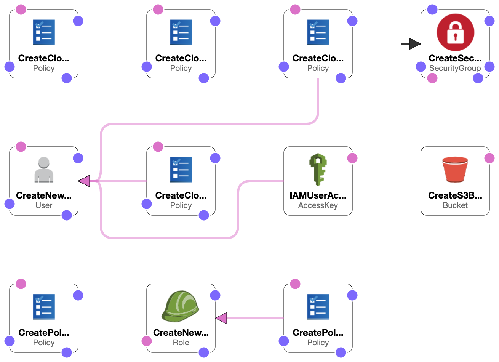
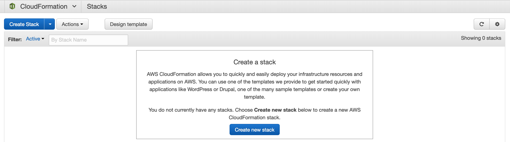
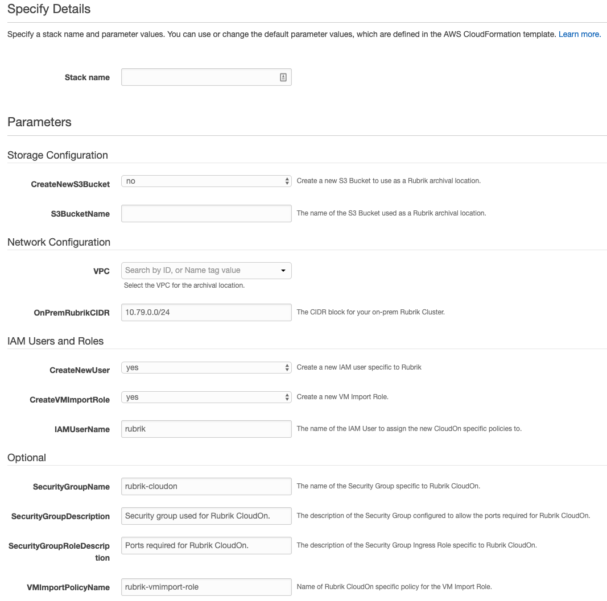

# Quick Start: AWS CloudFormation Template for CloudOn

Complete the AWS configuration process required for the Rubrik CloudOn feature which provides the ability to convert a snapshot, an archived snapshot, or a replica into an Amazon Machine Image (AMI) and then run that AMI on an Amazon virtual private cloud (VPC).

The end-to-end workflow is as follows:

- Create Policies
- Create IAM User, Role, and Access Key
- Create Security Group
- Create S3 Bucket\*
- A new KMS key is created (optional)

_\* The template can also consume a previously created IAM User or S3 Bucket_



This is automated as a part of the CloudFormation template, however, permission templates can be found in this repo:

- [`cloudon_security_policy.json`](../cloudon_security_policy.json)
- [`cloudout_security_policy.json`](../cloudout_security_policy.json)
- [`vmimport.json`](../vmimport.json)

# CloudFormation Stack

Navigate to **Services** > **CloudFormation** > **Stacks** and select **Create Stack**.



Either select **Upload a template to Amazon S3** or, preferably, **Specify an Amazon S3 template URL**.


The template file can be downloaded [here](https://rubrik-cfts.s3-us-west-1.amazonaws.com/rubrik_cloudon.template). Copy the following URL:

```url
https://rubrik-cfts.s3-us-west-1.amazonaws.com/rubrik_cloudon.template
```

On the **Specify Details** page, enter the **Stack name** and the **S3BucketName**.



Press **Next** through the **Options** page.

Use the **Review** page to ensure all the information is correct. Press **Create** once reviewed.

Follow the Rubrik CDM User Guide to complete the setup.

# Variables

This section provides information regarding the variables used in the template.

## Storage Configuration

| Variable          | Default | Description                                                   |
| ----------------- | ------- | ------------------------------------------------------------- |
| CreateS3NewBucket | no      | Create a new S3 Bucket to use as a Rubrik archival location.  |
| S3BucketName      | n/a     | The name of the S3 Bucket used as a Rubrik archival location. |

## Network Configuration

| Variable                     | Default                                 | Description                                                                                      |
| ---------------------------- | --------------------------------------- | ------------------------------------------------------------------------------------------------ |
| VPC                          | n/a                                     | Select the VPC for the archival location.                                                        |
| Subnet                       | n/a                                     | Select the Subnet for the archival location.                                                     |
| OnPremRubrikCIDR             | 10.79.0.0/24 (example only)             | The CIDR block for your on-prem Rubrik Cluster.                                                  |
| SecurityGroupName            | rubrik-cloudon                          | The name of the Security Group specific to Rubrik CloudOn.                                       |
| SecurityGroupDescription     | Security group used for Rubrik CloudOn. | The description of the Security Group configured to allow the ports required for Rubrik CloudOn. |
| SecurityGroupRoleDescription | Ports required for Rubrik CloudOn.      | The description of the Security Group Ingress Role specific to Rubrik CloudOn                    |

## IAM Users and Roles

| Variable           | Default              | Description                                                                                                                                                           |
| ------------------ | -------------------- | --------------------------------------------------------------------------------------------------------------------------------------------------------------------- |
| CreateNewUser      | yes                  | Create a new IAM user specific to Rubrik CloudOn. If 'no' is selected the S3 IAM policy will be attached to the provided IAMUserName which should already be created. |
| IAMUserName        | rubrik-cloudon       | The name of the new or existing IAM User to assign the new CloudOn specific policies to.                                                                              |
| CreateVMImportRole | yes                  | Create a new VM Import Role. If the vmimport role has already been created or if another stack controls the vmimport role creation process select 'no'.               |
| VMImportPolicyName | rubrik-vmimport-role | Name of Rubrik CloudOn specific policy for the VM Import Role.                                                                                                        |

## KMS

Default names and descriptions for the various IAM Users, Policies, and Security Group created during the process.

| Variable | Default | Description                          |
| -------- | ------- | ------------------------------------ |
| UseKMS   | yes     | Create a new KMS key for encryption. |

Output from the CloudFormation template:

| Variable         | Description                                         |
| ---------------- | --------------------------------------------------- |
| AWSBucketName    | The S3 Bucket name. (if applicable)                 |
| IAMUserAccessKey | Access Key for the new IAM User. (if applicable)    |
| IAMUserSecretKey | Secret Key for the new IAM user. (if applicable)    |
| KMSKeyId         | The KMS Key ID used for encryption. (if applicable) |
| Region           | The AWS Region where the configuration took place.  |
| SecurityGroupId  | ID for the newly created Security Group             |
| SubnetId         | Subnet ID where the Rubrik Bolt Instances will run. |
| VPCId            | VPC ID where the Rubrik Bolt Instance is created.   |
